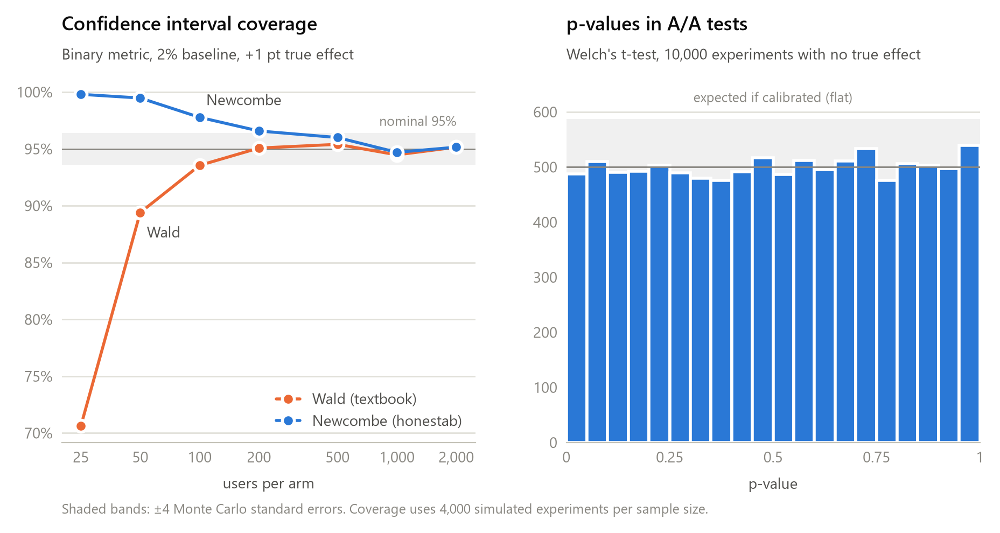

# honestab

**A/B tests with honest error bars.**

[](https://github.com/johnira-ai/honestab/actions/workflows/tests.yml)


honestab is a small A/B testing toolkit where every statistical method comes
with a simulation-based calibration test. Before a method ships, it is run on
thousands of simulated experiments where the true effect is known, and it has
to prove that its p-values and confidence intervals mean what they claim.

## Why calibration matters

A 95% confidence interval is a promise: across many experiments, it should
contain the true effect 95% of the time. A test at `alpha = 0.05` makes a
similar promise: when there is no real effect, it should declare a winner only
5% of the time.

Plenty of A/B testing code quietly breaks these promises. A wrong variance
formula, a pooled standard error in the wrong place, or a test that assumes
equal variances when the arms differ can all look fine on a single dataset.
They are only visible in aggregate, and in practice that means shipping
features that did nothing, or missing ones that worked.

Calibration testing checks the promises directly:

1. Simulate thousands of experiments with a known true effect, including zero.
2. Analyze each one with the method under test.
3. Check that the false positive rate is close to `alpha`, that confidence
   intervals cover the true effect `1 - alpha` of the time, and that p-values
   are uniformly distributed under the null.

If a method can't pass that, its error bars aren't honest, and it doesn't ship.

<picture>
  <source media="(prefers-color-scheme: dark)" srcset="docs/images/calibration-dark.png">
  
</picture>

The left chart is why honestab uses the Newcombe interval: the textbook Wald
interval, found in most A/B testing tutorials, quietly under-covers when
samples are small or conversions are rare. Regenerate both charts with
`uv run python scripts/calibration_figure.py`.

## Installation

honestab uses [uv](https://docs.astral.sh/uv/) and requires Python 3.11+.

```bash
git clone https://github.com/johnira-ai/honestab.git
cd honestab
uv sync
```

## Usage

```python
from honestab import analyze, simulate

# Simulate an experiment: 10% baseline conversion, true lift of +1 point.
df = simulate(10_000, metric="binary", baseline=0.10, effect=0.01, seed=42)

result = analyze(df)
print(result)
# two-proportion z-test: effect = +0.0132 (95% CI [+0.0047, +0.0217]), p = 0.002339

result.relative_lift  # 0.134 -> +13.4% relative to control
result.significant  # True
```

`simulate()` returns a DataFrame with `group` and `value` columns, and records
the ground truth in `df.attrs["true_effect"]`. `analyze()` works on any
DataFrame in that shape, so you can pass it real experiment data too:

```python
result = analyze(
    my_df,
    metric="continuous",
    group_col="variant",
    value_col="revenue",
    control="A",
    treatment="B",
)
```

Missing outcomes raise an error rather than silently skewing the result; pass
`nan_policy="omit"` to drop them instead.

Supported methods:

| Metric       | Test                                   | Confidence interval               |
| ------------ | -------------------------------------- | --------------------------------- |
| `binary`     | Two-proportion z-test (pooled SE)      | Newcombe hybrid score interval    |
| `continuous` | Welch's t-test (unequal variances)     | Welch interval                    |

The Newcombe interval is used instead of the textbook Wald interval because
Wald under-covers with small samples or rare events (about 93% coverage for a
nominal 95% interval at 100 users per arm and a 2% baseline).

## Development

```bash
uv sync                    # install the package and dev tools
uv run ruff check          # lint
uv run ruff format --check # formatting
uv run mypy                # type check (strict)
uv run pytest              # tests
```

The calibration suite in `tests/test_calibration.py` runs 2,000 simulated
experiments per check and verifies, for both binary and continuous metrics:

- the false positive rate under an A/A test matches `alpha`;
- confidence intervals cover the true effect at the nominal rate;
- p-values are uniform under the null (Kolmogorov–Smirnov test).

It also checks that the binary interval never under-covers in a small-sample,
rare-event setting (5,000 experiments with 100 users per arm), where discrete
outcomes make exact nominal coverage impossible.

Tolerances are Monte Carlo bands of four binomial standard errors, and seeds
are fixed so results are reproducible. `tests/test_analyze.py` pins results
against independent reference implementations (scipy, statsmodels) and checks
that invalid input fails loudly.

CI runs lint, formatting, strict type checking and a package build, and runs the
tests on Python 3.11–3.14 on Linux, on Windows and macOS, and against the
lowest supported versions of numpy, pandas and scipy.

## Roadmap

Each item will ship with its own calibration test.

- [ ] **SRM checks**: detect sample ratio mismatch before trusting results
- [ ] **CUPED**: variance reduction using pre-experiment covariates
- [ ] **Delta method**: correct standard errors for ratio metrics (e.g. revenue per session)
- [ ] **Sequential testing**: valid inference when peeking at results early
- [ ] **Power analysis**: sample size and minimum detectable effect calculations
- [ ] **Segment analysis**: per-segment effects with multiple comparison control
- [ ] **Streamlit dashboard**: interactive analysis and calibration reports

## License

[MIT](LICENSE)
